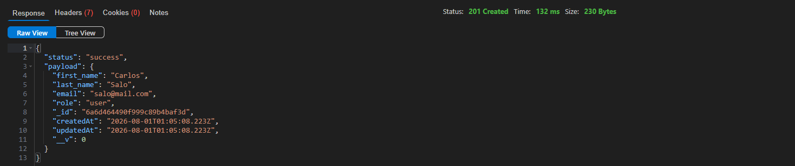
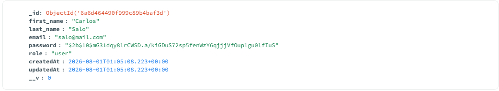
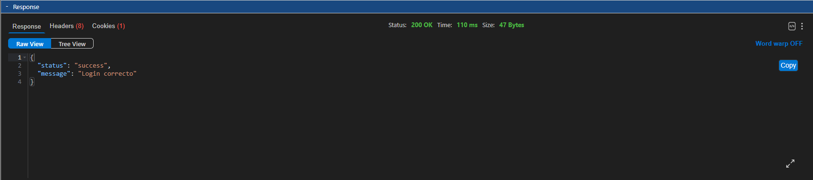
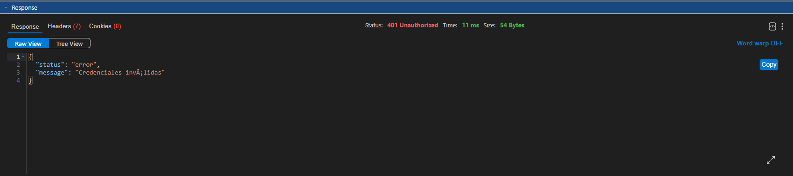
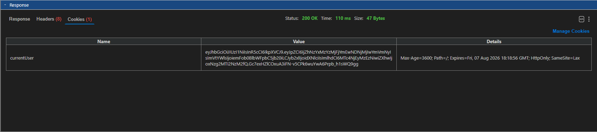
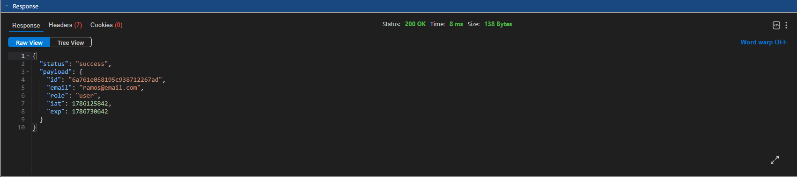
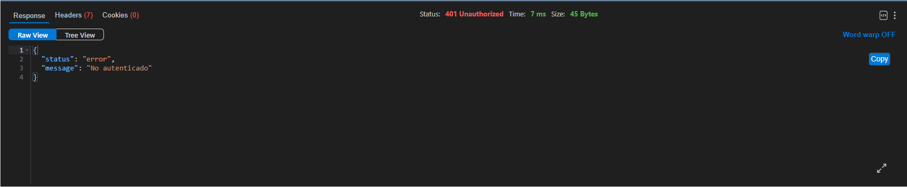
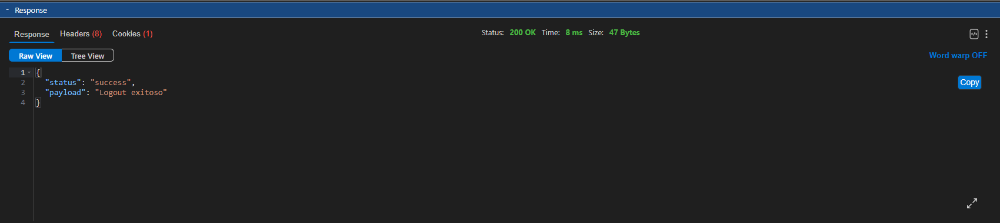
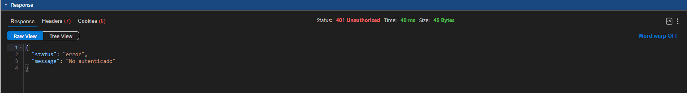
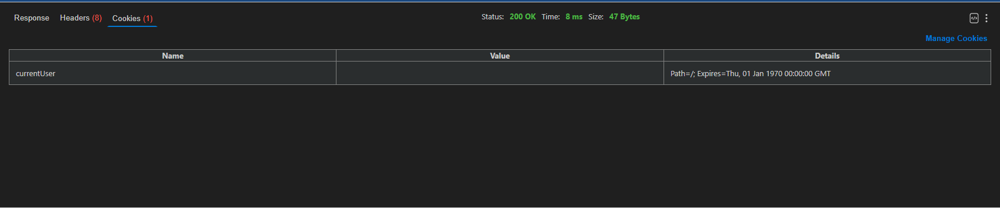

# Another Night

## Descripción

Sitio sobre eventos e inscripciones a fiestas electrónicas desarrollado como proyecto de Backend II.

## Instalación

1. Cloná el repositorio

```bash
git clone https://github.com/JuanAliAmid/Another-Night.git
cd Another-Night
```

2. Instalá las dependencias

```bash
npm install
```

3. Creá un archivo `.env` en la raíz con estas variables:

```
PORT=3000
MONGO_URL="mongodb://localhost:27017/another-night"
JWT_SECRET= clave_secreta
JWT_EXPIRES_IN=7d
NODE_ENV=development
```

4. Levantá el servidor:

```bash
npm start
```

## Tecnologías

- Dotenv
- Express
- Mongoose

## Variables de entorno

- `PORT` = #Puerto del servidor
- `MONGO_URL` = #URL de mongodb
- `NODE_ENV` = #Entorno: development | production | test 
- `JWT_SECRET` = #Clave secreta para firmar JWT    
- `JWT_EXPIRES_IN`= #Duración de token


## Cómo ejecutar

- `npm start` "node src/server.js"
- `npm run dev` "node --watch src/server.js"

## Rutas disponibles

- `/api/health`
- `/api/users`
- `/api/sessions`
- `/api/events`
- `/api/tickets`

## Endpoint: Registro de usuario

**`POST /api/sessions/register`**

Registra un nuevo usuario. La contraseña se guarda hasheada con bcrypt y nunca se devuelve en la respuesta.

### Campos esperados (body JSON)

| Campo        | Tipo   | Obligatorio | Validación                                                                                  |
|--------------|--------|-------------|---------------------------------------------------------------------------------------------|
| `first_name` | string | Sí          | No vacío                                                                                    |
| `last_name`  | string | Sí          | No vacío                                                                                    |
| `email`      | string | Sí          | Formato válido (`algo@algo.algo`); se normaliza a minúsculas y sin espacios; debe ser único |
| `password`   | string | Sí          | Más de 6 caracteres; se rechazan contraseñas obvias (`12345`, `12345678910`, `aeiou`)       |

`role` no se envía en el body — el sistema lo asigna automáticamente como `user`.

### Ejemplo de request

```json
POST /api/sessions/register
Content-Type: application/json

{
  "first_name": "Amelia",
  "last_name": "Perez",
  "email": "Amelia@Mail.com",
  "password": "Secreta123"
}
```

### Ejemplo de respuesta (201 Created)

```json
{
    "status": "success",
    "payload": {
        "first_name": "Amelia",
        "last_name": "Perez",
        "email": "amelia@mail.com",
        "role": "user",
        "_id": "6a6cf7b577f3e640583b5cb5",
        "createdAt": "2026-07-31T19:29:57.297Z",
        "updatedAt": "2026-07-31T19:29:57.297Z",
        "__v": 0      
    }
}
```

### Otras respuestas posibles

- `400` — Faltan campos obligatorios, email con formato inválido, o contraseña inválida.
- `409` — El email ya está registrado.

### Cómo probarlo

1. Levantá el servidor (`npm start`) con Mongo corriendo.
2. Mandá un `POST` a `http://localhost:3000/api/sessions/register` con el body de ejemplo de arriba (Postman, Insomnia, FetchClient o `curl`).
3. Confirmá que la respuesta no incluye el campo `password`.
4. Opcional: revisá la base con MongoDB Compass o `mongosh` para confirmar que la contraseña quedó como hash bcrypt, nunca en texto plano.

### Evidencia

**Respuesta del endpoint (sin `password`):**


**Usuario guardado en MongoDB (`password` hasheada):**


## Endpoint: Login de usuario

**`POST /api/sessions/login`**

Loguea un usuario. Si las credenciales son correctas, genera un JWT y lo guarda en la cookie `currentUser` (`httpOnly`, `sameSite: 'lax'`, `maxAge: 3600000`).

### Campos esperados (body JSON)

| Campo      | Tipo   | Obligatorio |
|------------|--------|-------------|
| `email`    | string | Sí          |
| `password` | string | Sí          |

### Ejemplo de request

```json
POST /api/sessions/login
Content-Type: application/json

{
  "email": "Amelia@Mail.com",
  "password": "Secreta123"
}
```

### Ejemplo de respuesta (`status`: 200, además setea la cookie `currentUser`)

```json
{
  "status": "success",
  "message": "Login correcto"
}
```

### Otras respuestas posibles

- `401` — Credenciales inválidas (mismo mensaje genérico, sin importar si falló el email o la contraseña).

### Cómo probarlo

1. Levantá el servidor (`npm start`) con Mongo corriendo y al menos un usuario ya registrado.
2. Mandá un `POST` a `http://localhost:3000/api/sessions/login` con el body de ejemplo de arriba (Postman, Insomnia, FetchClient o `curl`).
3. Confirmá en la pestaña de Cookies de tu cliente que llegó `currentUser` marcada como `HttpOnly`.

### Evidencia

**Login correcto (200):**


**Login con credenciales inválidas (401):**


**Cookie `currentUser` seteada en la respuesta:**


## Endpoint: Usuario actual

**`GET /api/sessions/current`**

Ruta protegida. Lee el JWT de la cookie `currentUser`, lo verifica, y devuelve los datos del usuario logueado.

### Ejemplo de request

GET /api/sessions/current
Cookie: currentUser=<token>

### Ejemplo de respuesta (`status`: 200)

```json
{
  "status": "success",
  "payload": {
    "id": "6a761e058195c938712267ad",
    "email": "ramos@email.com",
    "role": "user",
    "iat": 1786125842,
    "exp": 1786730642
  }
}
```

### Otras respuestas posibles

- `401` — No hay cookie, o el token es inválido/expirado.

### Cómo probarlo

1. Iniciá sesión primero (`/api/sessions/login`) para obtener la cookie.
2. Mandá un `GET` a `http://localhost:3000/api/sessions/current` con esa cookie incluida.
3. Repetí la request sin la cookie (o con el token alterado) y confirmá el 401.

### Evidencia

**`/current` con cookie válida (200):**


**`/current` sin cookie o con token inválido (401):**


## Endpoint: Logout

**`POST /api/sessions/logout`**

Elimina la cookie `currentUser`, cerrando la sesión.

### Ejemplo de request

POST /api/sessions/logout

### Ejemplo de respuesta (`status`: 200)

```json
{
  "status": "success",
  "payload": "Logout exitoso"
}
```
### Otras respuestas posibles

- `401` — No autenticado.

### Cómo probarlo

1. Estando logueado (con la cookie `currentUser`), mandá un `POST` a `http://localhost:3000/api/sessions/logout`.
2. Confirmá que la cookie queda con fecha de expiración en el pasado.
3. Repetí el `GET /api/sessions/current` y verificá que ahora devuelve 401.

### Evidencia

**Logout correcto (200):**


**Logout incorrecto (401):**


**Cookie `currentUser` eliminada (Expires en el pasado):**



## Estructura de carpetas
```
Another Night/
├── src/
│   ├── app.js                
│   ├── server.js 
│   ├── assets/
│   │   ├── client.png
│   │   ├── current200.png
│   │   ├── current401.png
│   │   ├── login200.png
│   │   ├── login200Cookie.png
│   │   ├── login400.png
│   │   ├── logout200.png
│   │   ├── logout401.png
│   │   ├── logoutCookie.png
│   │   └── mongo.png            
│   ├── config/
│   │   ├── database.js
│   │   └── env.js
│   ├── routes/
│   │   ├── events.routes.js
│   │   ├── tickets.routes.js
│   │   ├── users.routes.js
│   │   ├── index.js
│   │   └── sessions.routes.js
│   ├── controllers/
│   │   ├── events.controller.js
│   │   ├── sessions.controller.js
│   │   ├── tickets.controller.js
│   │   └── users.controller.js
│   ├── services/
│   │   ├── event.service.js
│   │   ├── ticket.service.js
│   │   └── user.service.js
│   ├── repositories/
│   │   ├── event.repository.js
│   │   ├── ticket.repository.js
│   │   └── user.repository.js
│   ├── dao/
│   │   ├── event.dao.js
│   │   ├── ticket.dao.js
│   │   └── users.dao.js
│   ├── models/
│   │   ├── user.model.js           
│   │   ├── event.model.js           
│   │   └── ticket.model.js          
│   ├── middlewares/
│   │   ├── auth.js
│   │   └── errorHandler.js          
│   └── utils/
│       ├── hash.js
│       ├── jwt.js
│       └── user.dto.js
├── .env.example              
├── .gitignore                
├── package-lock.json               
├── package.json
└── README.md
```