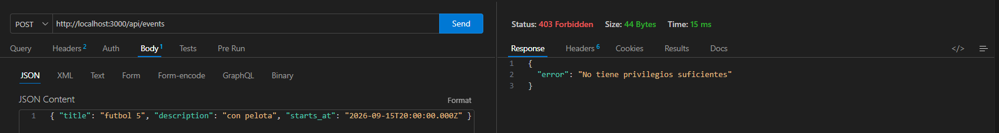
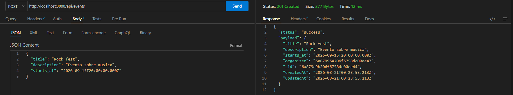
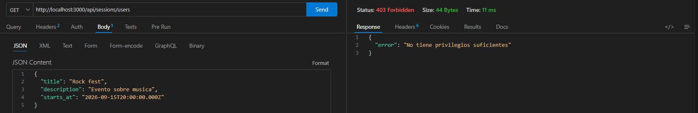
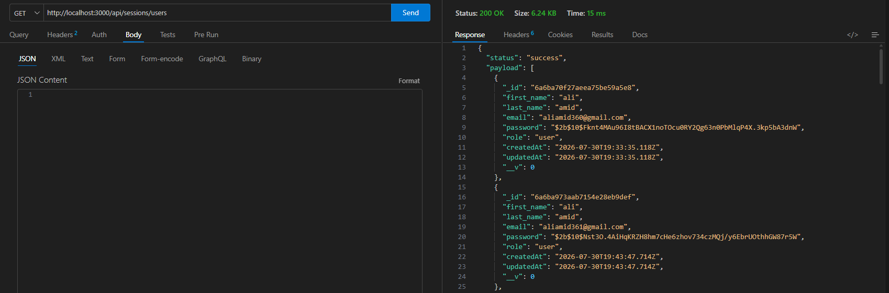
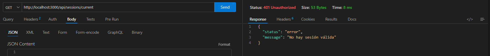
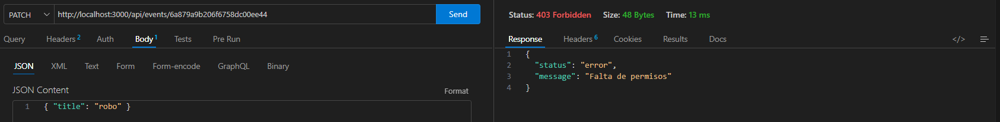

# Another Night

## Descripción

Sitio sobre eventos e inscripciones a fiestas electrónicas desarrollado como proyecto de Backend II.

## Instalación

1. Cloná el repositorio

```bash
git clone https://github.com/JuanAliAmid/Another-Night.git
cd Another-Night
```

2. Instalá las dependencias

```bash
npm install
```

3. Creá un archivo `.env` en la raíz con estas variables:

```
PORT=3000
MONGO_URL="mongodb://localhost:27017/another-night"
JWT_SECRET= clave_secreta
JWT_EXPIRES_IN=7d
NODE_ENV=development
MAIL_HOST=smtp.gmail.com
MAIL_PORT=587
MAIL_USER=tu_correo@gmail.com
MAIL_PASS=tu_contraseña_de_aplicacion
MAIL_FROM="Another Night <tu_correo@gmail.com>"
```

4. Levantá el servidor:

```bash
npm start
```

## Tecnologías

- Dotenv
- Express
- Mongoose
- Passport
- passport-local
- jsonwebtoken
- bcrypt 
- passport-jwt

## Variables de entorno

- `PORT` = #Puerto del servidor
- `MONGO_URL` = #URL de mongodb
- `NODE_ENV` = #Entorno: development | production | test 
- `JWT_SECRET` = #Clave secreta para firmar JWT    
- `JWT_EXPIRES_IN`= #Duración de token
- `MAIL_HOST` = #Host SMTP del servicio de email
- `MAIL_PORT` = #Puerto SMTP
- `MAIL_USER` = #Usuario/email para autenticar el envío
- `MAIL_PASS` = #Contraseña o app password del usuario de mail
- `MAIL_FROM` = #Dirección que figura como remitente

## Cómo ejecutar

- `npm start` "node src/server.js"
- `npm run dev` "node --watch src/server.js"

## Estrategias Passport

La estrategia de `register` valida la existencia de los campos first_name, last_name, email y password, comunicando que son obligatorios si falta alguno. Valida el formato del password (exige más de 6 caracteres y rechaza contraseñas obvias como 12345, 12345678910 o aeiou) y el formato del email mediante una expresión regular. El email se normaliza a minúsculas y sin espacios antes de chequear si ya está registrado, evitando que Ana@Mail.com y ana@mail.com se traten como usuarios distintos. Si el email ya existe, se rechaza el registro. Si todas las validaciones pasan, el password se hashea con bcrypt y el usuario se crea; la estrategia entrega el nuevo usuario a done(), que queda disponible para que la ruta arme la respuesta HTTP correspondiente.

La estrategia de `Login` valida la existencia de los campos email y password, comunicando que son obligatorios si falta alguno. Valida si los datos ingresados pertenecen a un usuario existente. Valida la contraseña hasheada con la original, si algunos de estos casos falla se rechaza el login con el mismo mensaje genérico siempre por seguridad, en caso de tener éxito se devuelve al usuario con datos minimos necesarios y permitiendo que la ruta genere el jwt y cookie.

La estrategia `jwt` busca el token en el header, sino lo encuentra ahí lo busca dentro de la cookie. Con el id busca un usuario, si el mismo no existe devolvemos status(401) con message: "Credenciales inválidas". En caso de éxito devolvemos el usuario excluyendo datos sensibles, solo con id, email y role.

## Providers externos 

El proyecto se encuentra preparado para providers externos futuros, solo se debería integrar lógica en passport.config.js. Por ejemplo, una ruta nueva como /api/sessions/google podría usar passport.authenticate('google', ...) para disparar esa estrategia y app.js nunca se modifica.

## Rutas disponibles

- `/api/health`
- `/api/users`
- `/api/sessions`
- `/api/events`
- `/api/tickets`

## Endpoint: Registro de usuario

**`POST /api/sessions/register`**

Registra un nuevo usuario. La contraseña se guarda hasheada con bcrypt y nunca se devuelve en la respuesta.

### Campos esperados (body JSON)

| Campo        | Tipo   | Obligatorio | Validación                                                                                  |
|--------------|--------|-------------|---------------------------------------------------------------------------------------------|
| `first_name` | string | Sí          | No vacío                                                                                    |
| `last_name`  | string | Sí          | No vacío                                                                                    |
| `email`      | string | Sí          | Formato válido (`algo@algo.algo`); se normaliza a minúsculas y sin espacios; debe ser único |
| `password`   | string | Sí          | Más de 6 caracteres; se rechazan contraseñas obvias (`12345`, `12345678910`, `aeiou`)       |

`role` no se envía en el body — el sistema lo asigna automáticamente como `user`.

### Ejemplo de request

```json
POST /api/sessions/register
Content-Type: application/json

{
  "first_name": "Amelia",
  "last_name": "Perez",
  "email": "Amelia@Mail.com",
  "password": "Secreta123"
}
```

### Ejemplo de respuesta (201 Created)

```json
{
    "status": "success",
    "payload": {
        "first_name": "Amelia",
        "last_name": "Perez",
        "email": "amelia@mail.com",
        "role": "user",
        "_id": "6a6cf7b577f3e640583b5cb5",
        "createdAt": "2026-07-31T19:29:57.297Z",
        "updatedAt": "2026-07-31T19:29:57.297Z",
        "__v": 0      
    }
}
```

### Otras respuestas posibles

- `400` — Faltan campos obligatorios, email con formato inválido, o contraseña inválida.
- `409` — El email ya está registrado.

### Cómo probarlo

1. Levantá el servidor (`npm start`) con Mongo corriendo.
2. Mandá un `POST` a `http://localhost:3000/api/sessions/register` con el body de ejemplo de arriba (Postman, Insomnia, FetchClient o `curl`).
3. Confirmá que la respuesta no incluye el campo `password`.
4. Opcional: revisá la base con MongoDB Compass o `mongosh` para confirmar que la contraseña quedó como hash bcrypt, nunca en texto plano.

### Evidencia

**Respuesta del endpoint (sin `password`):**


**Usuario guardado en MongoDB (`password` hasheada):**


## Endpoint: Login de usuario

**`POST /api/sessions/login`**

Loguea un usuario. Si las credenciales son correctas, genera un JWT y lo guarda en la cookie `currentUser` (`httpOnly`, `sameSite: 'lax'`, `maxAge: 3600000`).

### Campos esperados (body JSON)

| Campo      | Tipo   | Obligatorio |
|------------|--------|-------------|
| `email`    | string | Sí          |
| `password` | string | Sí          |

### Ejemplo de request

```json
POST /api/sessions/login
Content-Type: application/json

{
  "email": "Amelia@Mail.com",
  "password": "Secreta123"
}
```

### Ejemplo de respuesta (`status`: 200, además setea la cookie `currentUser`)

```json
{
  "status": "success",
  "message": "Login correcto"
}
```

### Otras respuestas posibles

- `401` — Credenciales inválidas (mismo mensaje genérico, sin importar si falló el email o la contraseña).

### Cómo probarlo

1. Levantá el servidor (`npm start`) con Mongo corriendo y al menos un usuario ya registrado.
2. Mandá un `POST` a `http://localhost:3000/api/sessions/login` con el body de ejemplo de arriba (Postman, Insomnia, FetchClient o `curl`).
3. Confirmá en la pestaña de Cookies de tu cliente que llegó `currentUser` marcada como `HttpOnly`.

### Evidencia

**Login correcto (200):**


**Login con credenciales inválidas (401):**


**Cookie `currentUser` seteada en la respuesta:**


## Endpoint: Usuario actual

**`GET /api/sessions/current`**

Ruta protegida. Lee el JWT de la cookie `currentUser`, lo verifica, y devuelve los datos del usuario logueado.

### Ejemplo de request

GET /api/sessions/current
Cookie: currentUser=<token>

### Ejemplo de respuesta (`status`: 200)

```json
{
  "status": "success",
  "payload": {
    "id": "6a761e058195c938712267ad",
    "email": "ramos@email.com",
    "role": "user"
  }
}
```

### Otras respuestas posibles

- `401` — No hay cookie, o el token es inválido/expirado.

### Cómo probarlo

1. Iniciá sesión primero (`/api/sessions/login`) para obtener la cookie.
2. Mandá un `GET` a `http://localhost:3000/api/sessions/current` con esa cookie incluida.
3. Repetí la request sin la cookie (o con el token alterado) y confirmá el 401.

### Evidencia

**`/current` con cookie válida (200):**


**`/current` sin cookie o con token inválido (401):**


## Endpoint: Logout

**`POST /api/sessions/logout`**

Elimina la cookie `currentUser`, cerrando la sesión.

### Ejemplo de request

POST /api/sessions/logout

### Ejemplo de respuesta (`status`: 200)

```json
{
  "status": "success",
  "message": "Logout exitoso"
}
```
### Otras respuestas posibles

- `401` — No autenticado.

### Cómo probarlo

1. Estando logueado (con la cookie `currentUser`), mandá un `POST` a `http://localhost:3000/api/sessions/logout`.
2. Confirmá que la cookie queda con fecha de expiración en el pasado.
3. Repetí el `GET /api/sessions/current` y verificá que ahora devuelve 401.

### Evidencia

**Logout correcto (200):**


**Logout incorrecto (401):**


**Cookie `currentUser` eliminada (Expires en el pasado):**


## Roles y autorización

El modelo `User` tiene un campo `role` (`enum: ['admin', 'organizer', 'user']`, `default: 'user'`). El registro público (`POST /api/sessions/register`) ignora cualquier `role` enviado en el body; el usuario siempre se crea como `user`.

## Usuarios de prueba

El registro público (`POST /api/sessions/register`) siempre crea usuarios
con `role: 'user'` — no existe (ni debería existir) un endpoint público
para asignarse `organizer` o `admin` directamente.

### Cómo probar los endpoints de `organizer` / `admin`

1. Registrate normalmente:
```bash
   POST /api/sessions/register
   { "first_name": "Ana", "last_name": "Test", "email": "ana@mail.com", "password": "12345678" }
```

2. Promové el usuario a mano, directo en la base (con `mongosh` o MongoDB Compass):
```js
   db.users.updateOne(
     { email: "ana@mail.com" },
     { $set: { role: "organizer" } } // o "admin"
   )
```

3. **Volvé a hacer login.** El JWT es una foto del usuario al momento de loguearse — cambiar el rol en la base no actualiza el token que ya tenías. Sin este paso, seguís recibiendo `403` aunque el rol ya esté cambiado en Mongo.
```bash
   POST /api/sessions/login
   { "email": "ana@mail.com", "password": "12345678" }
```

4. Ya podés usar la cookie de esta sesión nueva para probar rutas de `organizer`/`admin` (crear eventos, ver inscriptos, editar cualquier evento como `admin`, etc).

> Nota: `src/tests/automated.test.js` automatiza exactamente este mismo procedimiento (`userModel.updateOne()` + nuevo login) para testear el flujo de `organizer` de punta a punta.

### Matriz de permisos

| Acción | user | organizer | admin |
|---|---|---|---|
| Consultar eventos publicados | ✅ | ✅ | ✅ |
| Crear eventos | ❌ | ✅ | ✅ |
| Modificar/cancelar eventos propios | ❌ | ✅ | ✅ |
| Modificar cualquier evento | ❌ | ❌ | ✅ |
| Ver todos los usuarios | ❌ | ❌ | ✅ |

### Middlewares

- **`authMiddle.auth`** — autenticación. Valida el JWT (header o cookie `currentUser`) vía Passport (`strategy 'jwt'`). Puebla `req.user` o responde `401`.
- **`roleAuth.rolesAuth(...roles)`** — autorización. Compara `req.user.role` contra los roles permitidos. Responde `403` si no coincide. Va siempre después de `auth`.

### 401 vs 403

- **401** = no hay sesión válida (falta o es inválido el token) → *"no sabemos quién sos"*.
- **403** = hay sesión válida, pero sin permiso para esa acción (rol incorrecto, o no es dueño del recurso) → *"sabemos quién sos, pero no podés hacer esto"*.

### Rutas protegidas

| Método | Ruta                     | Middlewares                                                  | Permiso                                |
|--------|--------------------------|---------------------------------------------------------------|-----------------------------------------|
| GET    | `/api/sessions/current`  | `auth`                                                        | Cualquier autenticado                   |
| GET    | `/api/users`             | `auth`, `rolesAuth('admin')`                                  | `admin`                                 |
| POST   | `/api/events`            | `auth`, `rolesAuth('organizer','admin')`                      | `organizer`, `admin`                    |
| PATCH  | `/api/events/:id/status` | `auth`, `adminOrOwnerMiddle`                                  | `organizer` (propio), `admin` (todos)   |
| PUT    | `/api/events/:id`        | `auth`, `adminOrOwnerMiddle`                                  | `organizer` (propio), `admin` (todos)   |

### Propiedad de recursos

En `PATCH /api/events/:id`, si el rol es `organizer`, se compara `event.organizer` contra `req.user._id`; si no coincide, `403`. `admin` no tiene esta restricción. Si el evento no existe, `404`.

### Evidencia

**`POST /api/events` con rol `user` (403):**


**`POST /api/events` con rol `organizer` (201):**


**Ruta administrativa con `organizer` (403):**


**Ruta administrativa con `admin` (200):**


**Ruta privada sin cookie (401):**


**`organizer` modificando evento ajeno (403):**


### API de Eventos

#### Rutas disponibles

|Método |Ruta                  |Descripción                                        |Rol requerido           |
|-------|-----------------------|----------------------------------------------------|-------------------------|
|POST   |/api/events            |Crear un nuevo evento                                |organizer, admin         |
|GET    |/api/events            |Listar eventos (con filtros, paginación y orden)     |Público / autenticado*   |
|GET    |/api/events/:id        |Obtener un evento por id                             |Público / autenticado*   |
|PUT    |/api/events/:id        |Editar campos de un evento existente                 |organizer (dueño), admin |
|PATCH  |/api/events/:id/status |Cambiar el estado de un evento                       |organizer (dueño), admin |

#### Detalle de rutas

- POST /api/events — Crear un nuevo evento. Se requiere estar logueado, y solo pueden crear eventos los usuarios con rol `organizer` o `admin`.

- GET /api/events — Listar eventos, con filtros, paginación y orden. Acción de acceso público, con filtrado por campos, paginación `(page, limit)` y orden ascendente o descendente por fecha.

- GET /api/events/:id — Obtener un evento por su id. Accesible para usuarios logueados y no logueados. Si el evento no existe, devuelve `{ status: 'error', message: 'Evento no encontrado' }`.

- PUT /api/events/:id — Editar campos de un evento existente. Permitido solo para el `organizer` dueño del evento o un `admin`. Si un usuario que no cumple esos requisitos intenta modificar el evento, devuelve `{ status: 'error', message: 'No tiene permisos' }`. También puede devolver `{ status: 'error', message: 'No se puede editar un evento cancelado o finalizado' }` cuando el evento está `cancelled`/`finished`.

- PATCH /api/events/:id/status — Cambiar el estado de un evento. Permitido solo para el dueño del evento o un `admin`. Si no se cumplen esos requisitos, devuelve `{ status: 'error', message: 'No tiene permisos' }`. Si se intenta asignar un valor de estado que no está en el `enum` de `EventModel`, devuelve `{ status: 'error', message: 'Error de estado' }`. También puede devolver `{ status: 'error', message: 'No se puede modificar el estado de un evento cancelado o finalizado' }` cuando el evento está `cancelled`/`finished`.

#### Filtros disponibles en el listado (GET /api/events)

Se pasan como query params, todos opcionales y combinables entre sí:

- `category`: filtra por categoría exacta. Valores permitidos: `Electronica`, `Reggaeton`, `Cumbia`, `Rock` (según el `enum` del modelo).
- `status`: filtra por estado del evento. Valores permitidos: `draft`, `published`, `cancelled`, `finished`.
- `page`: número de página `(default: 1)`.
- `limit`: cantidad de resultados por página `(default: 10)`.
- `sort`: orden por fecha. `date` para ascendente, `-date` para descendente.
- `location`: filtrado por ubicación del evento, sin distinguir mayúsculas/minúsculas.
- `dateFrom`: filtrado por fecha igual o posterior a la indicada.
- `dateTo`: filtrado por fecha igual o anterior a la indicada.

La respuesta incluye `data`, `page`, `limit`, `total` y `totalPages`.

#### Roles y permisos
- `user`: no puede crear ni modificar eventos.
- `organizer`: puede crear eventos, y editar/cambiar el estado únicamente de los eventos donde figura como organizer.
- `admin`: puede editar y cambiar el estado de cualquier evento, sin importar quién sea el organizador.
#### Reglas de negocio principales
- No se puede crear un evento con una fecha (`date`) anterior a la fecha actual.
- `capacity` debe ser mayor a 0.
- `price` no puede ser negativo.
- Un evento en estado `cancelled` o `finished` no puede volver a cambiar de estado.
- La edición de campos (`PUT`) y el cambio de estado (`PATCH` .../`status`) son operaciones separadas, con rutas distintas.

### API de Tickets / Inscripciones

Permite que un usuario autenticado se inscriba a un evento publicado, gestionando cupos, evitando inscripciones duplicadas, permitiendo cancelaciones y notificando por email.

#### Modelo `Ticket`

Solo guarda referencias (`ObjectId`) a `User` y `Event`, nunca los objetos completos embebidos.

| Campo               | Tipo     | Detalle                                              |
|---------------------|----------|-------------------------------------------------------|
| `user`              | ObjectId | Referencia a `User`                                    |
| `event`             | ObjectId | Referencia a `Event`                                   |
| `status`            | String   | `active` \| `pending` \| `cancelled` (default: `active`) |
| `quantity`          | Number   | Cantidad de entradas (mínimo 1)                        |
| `reservationCode`   | String   | Código de reserva único, generado por el servidor al confirmar la inscripción |
| `cancelledAt`       | Date     | Se completa recién al cancelar (`null` hasta entonces) |

#### Rutas disponibles

| Método | Ruta                            | Acceso                              |
|--------|----------------------------------|--------------------------------------|
| POST   | `/api/events/:eid/tickets`       | Autenticado (cualquier rol)          |
| GET    | `/api/events/:eid/tickets`       | `organizer` dueño del evento, o `admin` |
| GET    | `/api/tickets/my-tickets`        | Autenticado (propios)                |
| PATCH  | `/api/tickets/:tid/cancel`       | Dueño del ticket, o `admin`          |

#### Detalle de rutas

- **POST /api/events/:eid/tickets** — Crea una inscripción. Antes de crear el ticket, valida en el service (nunca en el controller): que el evento exista, que esté `active` (no `cancelled`/`finished`), que `quantity` sea un número mayor a 0, que haya cupos suficientes (capacidad del evento menos la suma de `quantity` de tickets `active`, sin contar los `cancelled`) y que el usuario no tenga ya un ticket `active` para ese mismo evento. Si todas las validaciones pasan, genera un `reservationCode` de reserva y envía un email de confirmación por Nodemailer.

- **GET /api/events/:eid/tickets** — Lista los tickets de un evento puntual. Protegida con `adminOrOwnerMiddle`: solo puede consultarla el `organizer` dueño de ese evento, o un `admin`.

- **GET /api/tickets/my-tickets** — Devuelve los tickets del usuario autenticado (`req.user`), incluyendo los datos del evento asociado (title, date, location) mediante `populate`, sin exponer datos de otros usuarios.

- **PATCH /api/tickets/:tid/cancel** — Cancela una inscripción propia. Valida en el service que el ticket exista, que pertenezca al usuario que pide la cancelación (o que sea `admin`) y que no esté ya cancelado. Cambia `status` a `cancelled` y completa `cancelledAt` con la fecha actual; el documento nunca se borra. Al quedar `cancelled`, ese cupo deja de contarse como ocupado y vuelve a estar disponible para nuevas inscripciones.

#### Códigos de error

| Código | Caso                                                                 |
|--------|------------------------------------------------------------------------|
| 400    | `quantity` inválida (no numérica o ≤ 0), o `:eid`/`:tid` con formato inválido |
| 401    | No hay sesión válida                                                    |
| 403    | Cancelar un ticket ajeno sin ser admin; consultar tickets de un evento ajeno sin ser admin |
| 404    | Evento o ticket inexistente                                             |
| 409    | Evento no publicado/cancelado/finalizado; sin cupos disponibles; ticket duplicado; ticket ya cancelado |

#### Notificaciones por email

Al confirmarse una inscripción, `nodeMailer.service.js` envía un email de confirmación vía Nodemailer (`config/nodeMailer.config.js`), usando las variables `MAIL_HOST`, `MAIL_PORT`, `MAIL_USER`, `MAIL_PASS` y `MAIL_FROM` del entorno — nunca credenciales hardcodeadas. En desarrollo se usa una cuenta de Gmail con contraseña de aplicación (requiere verificación en 2 pasos activada en la cuenta de Google).

## Arquitectura en capas

La API está organizada en capas con responsabilidades separadas. Cada entidad principal (`User`, `Event`, `Ticket`) tiene su propio DAO, Repository y Service. El flujo de una request siempre respeta este orden:

```
Request → Router → Middleware (auth/permisos) → Controller → Service → Repository → DAO → Modelo (Mongoose)
```

Ninguna capa se salta a la siguiente: un Controller nunca llama a un Repository o DAO directamente, y un Service nunca importa un modelo de Mongoose.

### DAO (`src/dao/`)
Es la única capa que importa y usa los modelos de Mongoose directamente. Expone operaciones puras de acceso a datos (`find`, `findOne`, `findById`, `create`, `update`), sin ninguna regla de negocio. Ejemplos: `users.dao.js`, `event.dao.js`, `ticket.dao.js`.

### Repository (`src/repositories/`)
Capa intermedia entre el Service y el DAO. No importa modelos de Mongoose, solo consume el DAO correspondiente. Traduce operaciones genéricas del DAO en métodos orientados al dominio (`findByEmail`, `getEventById`, `getTicketById`). Es el único punto de entrada permitido al DAO.

### Service (`src/services/`)
Concentra toda la lógica de negocio de la aplicación: validaciones de datos, control de cupos y estados de eventos, verificación de duplicados (email ya registrado, inscripción repetida), permisos sobre recursos propios, hasheo de contraseñas y disparo de notificaciones por email. Consume repositories, nunca DAOs ni modelos. Los errores de negocio se lanzan acá con `error.status` seteado (400, 401, 403, 404, 409), para que el middleware de errores los traduzca al código HTTP correcto.

### Controller (`src/controllers/`)
Solo coordina la request y la response: extrae datos del `body`/`params`/`query`, llama al Service correspondiente, aplica el DTO si la respuesta lo requiere, y devuelve el resultado. No calcula cupos, no valida estados ni resuelve ninguna regla de negocio — toda esa lógica vive en el Service.

### DTO (`src/dto/res.dto.js`)
Filtra los datos que efectivamente se envían al cliente antes de la respuesta final, como capa extra de seguridad (además del `.select()` aplicado en los DAO/populate de origen). `userDto` y `ticketDto` remueven el campo `password` — incluyendo el de un `user` embebido por `populate` dentro de un ticket. Se aplica en el Controller, justo antes de armar la respuesta.

### Middlewares (`src/middlewares/`)
`authMiddle` valida la sesión (JWT), `adminOrOwnerMiddle` valida permisos sobre un recurso (consultando el Service correspondiente, no el modelo directamente), `roleAuth` valida rol, y `errorHandler` centraliza el formato de todas las respuestas de error de la API.

## Testing

El proyecto incluye un test de integración (`src/tests/automated.test.js`) que corre contra una instancia de MongoDB en memoria (`mongodb-memory-server`), sin tocar la base de datos real.

### Herramientas

- `node:test` (test runner nativo de Node)
- `supertest` (requests HTTP simuladas)
- `mongodb-memory-server` (MongoDB en memoria para tests)

### Cómo correrlo

```bash
npm test
```

Internamente ejecuta:
```bash
node --test src/tests/automated.test.js
```

**Nota:** la primera corrida descarga el binario de MongoDB que usa `mongodb-memory-server` (requiere conexión a internet). Las corridas siguientes usan el binario cacheado y son más rápidas.

### Qué cubre

| Test | Verifica |
|------|----------|
| `POST /api/sessions/register` | Crea el usuario y la respuesta no expone `password` |
| `POST /api/sessions/login` | Login correcto y seteo de cookie de sesión |
| `GET /api/sessions/current` (con cookie) | Devuelve el usuario logueado sin `password` |
| `GET /api/sessions/current` (sin cookie) | Devuelve 401 |
| `POST /api/events` (sin rol organizer/admin) | Devuelve 403 |
| Flujo completo | Promover a organizer → crear evento → publicar (cambiar `status`) → inscribirse → evitar inscripción duplicada (409) → ver inscriptos sin exponer `password` del usuario populado → cancelar ticket → evitar cancelación duplicada (409) |

El flujo completo cubre de punta a punta las reglas de negocio principales: control de roles, control de cupos, inscripción única por usuario, transiciones de estado válidas en tickets, y que el modelo `User` nunca se filtra con `password` incluido — ni en respuestas directas ni en documentos populados.

## Evidencia — Flujo completo (10 casos)

Capturas de los 10 casos verificados antes de la entrega en [`src/assets/evidencia/`](./src/assets/evidencia/).

| Caso | Descripción | Resultado |
|------|-------------|-----------|
| 1 | Registro → login → current → logout → current 401 | ✅ |
| 2 | user sin rol crea evento | ✅ 403 |
| 3 | organizer crea → publica → user se inscribe | ✅ |
| 4 | Inscripción duplicada | ✅ 409 |
| 5 | Sin cupo disponible | ✅ 409 |
| 6 | Cancelar ticket → cupo liberado → nueva inscripción | ✅ |
| 7 | Organizer edita evento ajeno | ✅ 403 |
| 8 | Admin edita evento ajeno | ✅ 200 |
| 9 | Ninguna respuesta expone password | ✅ |
| 10 | Paginación con estructura correcta | ✅ |

## Estructura de carpetas
```
Another Night/
├── src/
│   ├── app.js                
│   ├── server.js 
│   ├── assets/
│   │   ├── evidencia/    # capturas de los 10 casos verificados
│   │   ├── client.png
│   │   ├── otro-dueño-403.png
│   │   ├── 401-sessions-current.png
│   │   ├── 200-sessoins-users--admin.png
│   │   ├── 403-sessions-users--no-admin.png
│   │   ├── 201-evento-creado.png
│   │   ├── event-create-403.png
│   │   ├── current200.png
│   │   ├── current401.png
│   │   ├── login200.png
│   │   ├── login200Cookie.png
│   │   ├── login400.png
│   │   ├── logout200.png
│   │   ├── logout401.png
│   │   ├── logoutCookie.png
│   │   └── mongo.png            
│   ├── config/
│   │   ├── database.js
│   │   ├── passport.config.js
│   │   ├── nodeMailer.config.js
│   │   └── env.js
│   ├── routes/
│   │   ├── events.routes.js
│   │   ├── tickets.routes.js
│   │   ├── users.routes.js
│   │   ├── index.js
│   │   └── sessions.routes.js
│   ├── controllers/
│   │   ├── events.controller.js
│   │   ├── sessions.controller.js
│   │   ├── tickets.controller.js
│   │   └── users.controller.js
│   ├── services/
│   │   ├── event.service.js
│   │   ├── ticket.service.js
│   │   ├── nodeMailer.service.js
│   │   └── user.service.js
│   ├── tests/
│   │   └── automated.test.js  
│   ├── repositories/
│   │   ├── event.repository.js
│   │   ├── ticket.repository.js
│   │   └── user.repository.js
│   ├── dao/
│   │   ├── event.dao.js
│   │   ├── ticket.dao.js
│   │   └── users.dao.js
│   ├── models/
│   │   ├── user.model.js           
│   │   ├── event.model.js           
│   │   └── ticket.model.js          
│   ├── middlewares/
│   │   ├── authMiddle.js
│   │   ├── adminOrOwnerMiddle.js
│   │   ├── roleAuth.js
│   │   └── errorHandler.js
│   ├── dto/
│   │   └── res.dto.js          
│   └── utils/
│       ├── hash.js
│       └──  jwt.js
├── .env.example              
├── .gitignore                
├── package-lock.json               
├── package.json
└── README.md
```